[Mermaid](https://mermaid.ai/open-source/) est une bibliothèque JavaScript qui permet de générer des diagrammes et schémas à partir de texte, inspiré par Markdown.  

J'aime particulièrement m'en servir pour de la documentation technique ou la rédaction d'articles (je vais m'en servir assez souvent sur ce site !), mais c'est aussi souvent utilisé pour des spécifications fonctionnelles, de la gestion de projet ou simplement pour visualiser une idée rapidement.  
Son utilisation est très simple, soit via l'éditeur gratuit sur https://mermaid.ai/live/, soit via son intégration dans certains outils : sur Obsidian, Github, VSCode, Notion... [la liste est longue](https://mermaid.ai/open-source/ecosystem/integrations-community.html#productivity-tools) !  

Je trouve que les schémas faits de cette façon sont bien plus simples à maintenir que sur Visio par exemple, pas de schéma qui décale tout quand on veut rajouter une action, pas de logiciel ou appli web lourde, et la possiblité d'ajouter des commentaires directement dans le code.

Toute la documentation est disponible sur le site https://mermaid.ai/open-source/intro/syntax-reference.html

## Exemples de diagrammes et schémas
### Flowchart
Pour commencer, le diagramme le plus courant. Idéal pour modéliser un **processus**, un **algorithme** ou un **flux de décision**.

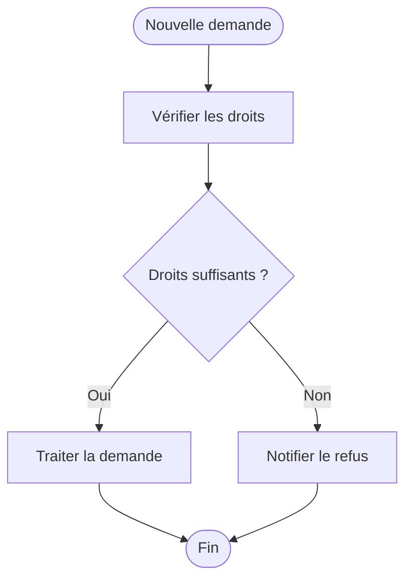

Le code :  
```text
flowchart TD
    A([Nouvelle demande]) --> B[Vérifier les droits]
    B --> C{Droits suffisants ?}
    C -- Oui --> D[Traiter la demande]
    C -- Non --> E[Notifier le refus]
    D --> F([Fin])
    E --> F
```
---

### Sequence Diagram

Un classique pour représenter des échanges entre différents acteurs dans le temps. Par exemple voici le diagramme d'authentification d'une app sur Entra ID ([original sur Microsoft Learn](https://learn.microsoft.com/fr-fr/entra/identity-platform/app-sign-in-flow)) :

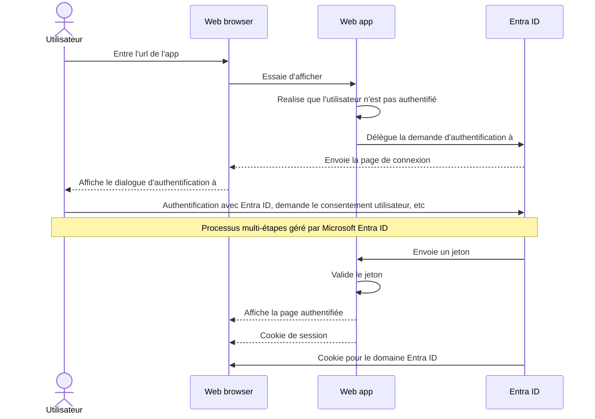

Et le code :  
```text
sequenceDiagram
    actor U as Utilisateur
    participant WB as Web browser
    participant App as Web app
    participant EID as Entra ID

    U->>WB: Entre l'url de l'app
    WB->>App: Essaie d'afficher
    App->>App: Realise que l'utilisateur n'est pas authentifié
    App->>EID: Délègue la demande d'authentification à
    EID-->>WB: Envoie la page de connexion
    WB-->>U: Affiche le dialogue d'authentification à
    U->>EID: Authentification avec Entra ID, demande le consentement utilisateur, etc
    Note over U,EID: Processus multi-étapes géré par Microsoft Entra ID
    EID->>App: Envoie un jeton
    App->>App: Valide le jeton
    App-->>WB: Affiche la page authentifiée
    App-->>WB: Cookie de session
    EID->>WB: Cookie pour le domaine Entra ID
```
---

### State Diagram

Il est souvent utiliser pour représenter le **cycle de vie** d'un objet ou d'un processus, par exemple un ticket de support, une commande, une demande d'accès…

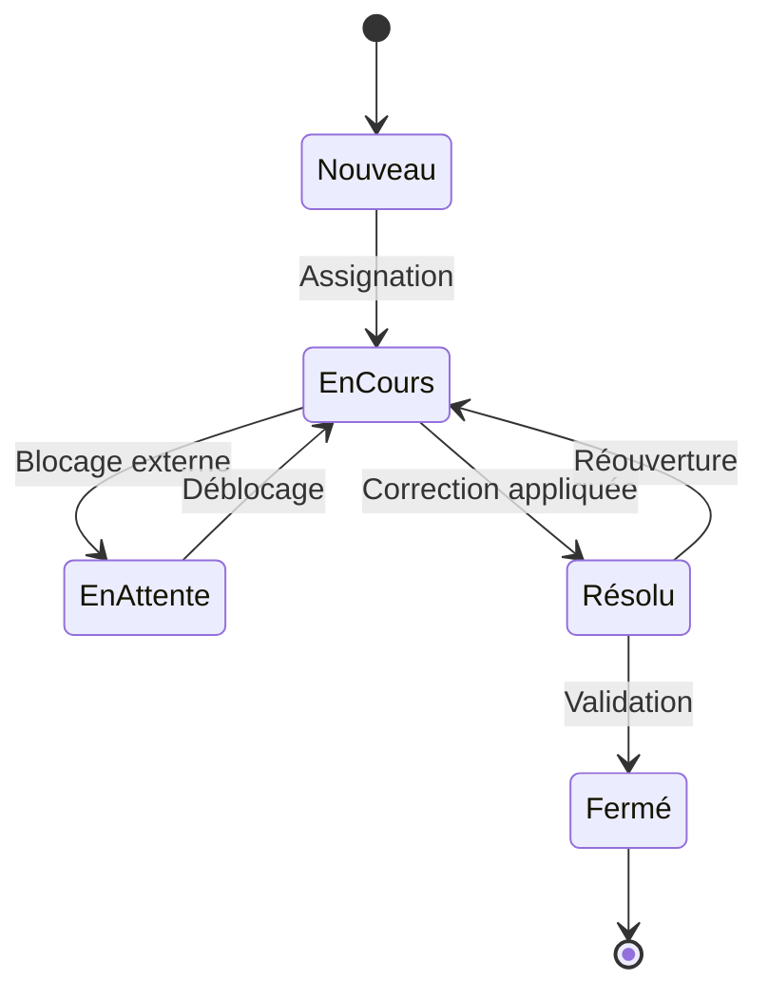

Le code :  
```text
stateDiagram-v2
    [*] --> Nouveau
    Nouveau --> EnCours : Assignation
    EnCours --> EnAttente : Blocage externe
    EnAttente --> EnCours : Déblocage
    EnCours --> Résolu : Correction appliquée
    Résolu --> Fermé : Validation
    Résolu --> EnCours : Réouverture
    Fermé --> [*]
```
---

### Gantt

Le classique de la **planification de projet**. Il représente les tâches, leurs durées et leurs dépendances sur un axe temporel (la barre rouge est le jour actuel).

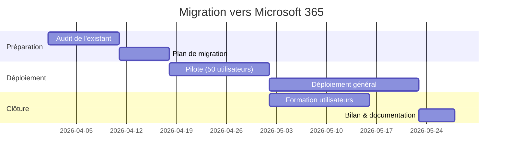

Le code :  
```text
gantt
    title Migration vers Microsoft 365
    dateFormat  YYYY-MM-DD
    section Préparation
    Audit de l'existant         :a1, 2026-04-01, 10d
    Plan de migration           :a2, after a1, 7d
    section Déploiement
    Pilote (50 utilisateurs)    :b1, after a2, 14d
    Déploiement général         :b2, after b1, 21d
    section Clôture
    Formation utilisateurs      :c1, after b1, 14d
    Bilan & documentation       :c2, after b2, 5d
```
---

### Un peu de camembert pour la route ?

Je pense qu'il se passe de présentation 😄🥖

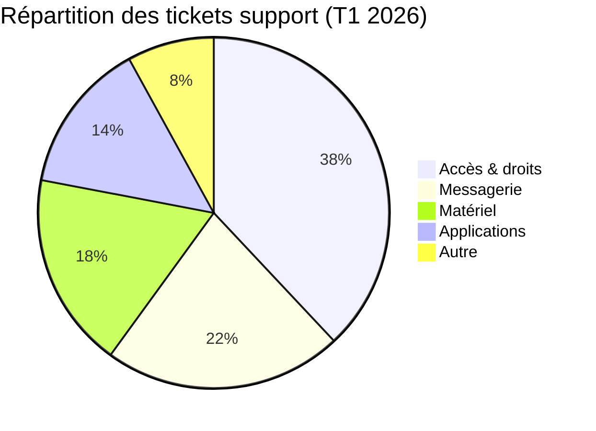

Le code :  
```text
pie title Répartition des tickets support (T1 2026)
    "Accès & droits" : 38
    "Messagerie" : 22
    "Matériel" : 18
    "Applications" : 14
    "Autre" : 8
```
---

### Timeline

Représente des **événements dans le temps**, par exemple l'historique d'un projet, l'évolution d'une technologie, les jalons clés...

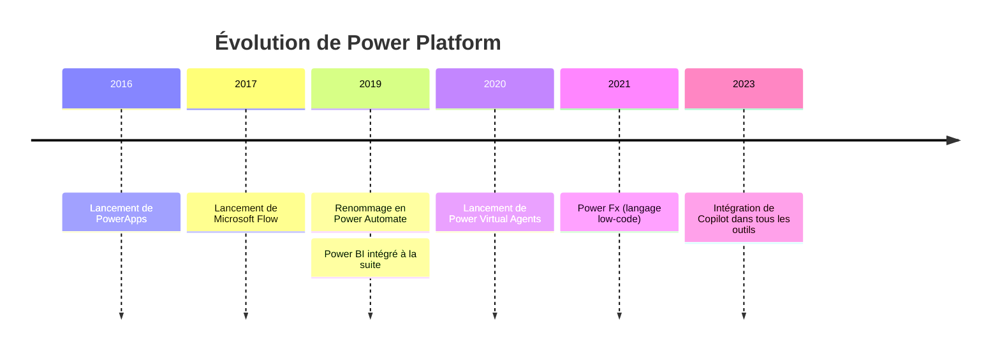

Le code :  
```text
timeline
    title Évolution de Power Platform
    2016 : Lancement de PowerApps
    2017 : Lancement de Microsoft Flow
    2019 : Renommage en Power Automate
         : Power BI intégré à la suite
    2020 : Lancement de Power Virtual Agents
    2021 : Power Fx (langage low-code)
    2023 : Intégration de Copilot dans tous les outils
```
---

## Diagrammes en "pré-version".

> [!WARNING] 
> Voici d'autres exemples de diagrammes. Attention, ils sont en préversion, leur utilisation peut changer sur les futures version de Mermaid !
### Sankey

Représente des **flux et leurs proportions**, répartition de licences, flux financiers, transferts de données, consommation d'énergie...


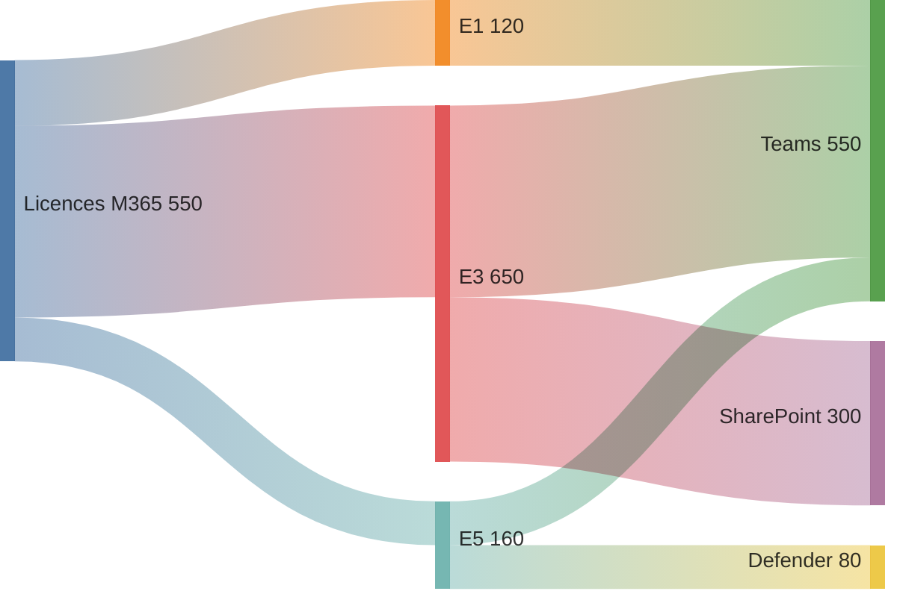

Le code :  
```text
sankey-beta
Licences M365,E1,120
Licences M365,E3,350
Licences M365,E5,80
E3,Teams,350
E1,Teams,120
E5,Teams,80
E5,Defender,80
E3,SharePoint,300
```
---

### XY Chart

Là aussi, je pense qu'il n'y a pas besoin de le présenter !

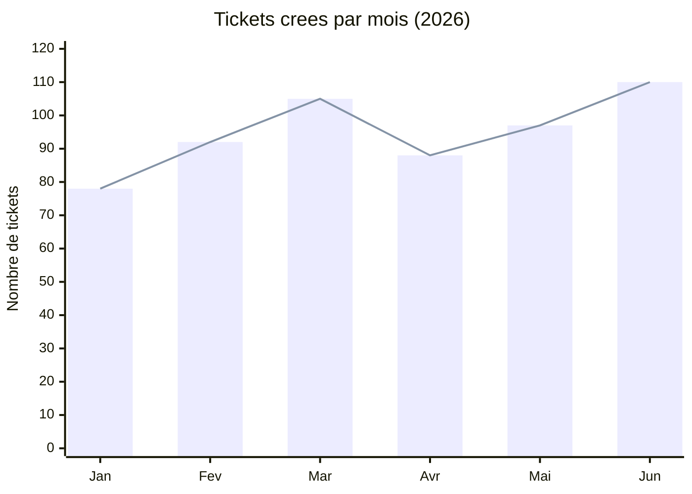

Le code :  
```text
xychart-beta
    title "Tickets crees par mois (2026)"
    x-axis [Jan, Fev, Mar, Avr, Mai, Jun]
    y-axis "Nombre de tickets" 0 --> 120
    bar [78, 92, 105, 88, 97, 110]
    line [78, 92, 105, 88, 97, 110]
```
---

### Kanban

Classique de la gestion de projet, par exemple pour documenter un état d'avancement dans une note ou un README.

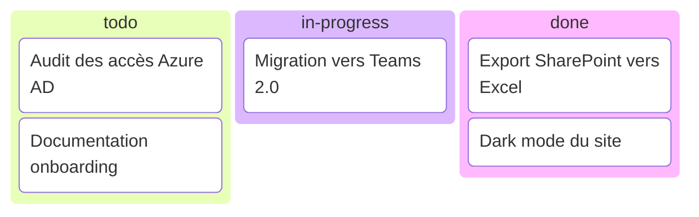
Le code :  
```text
kanban
  todo
    Audit des acces["Audit des accès Azure AD"]
    Doc onboarding["Documentation onboarding"]
  in-progress
    Migration Teams["Migration vers Teams 2.0"]
  done
    Export SharePoint["Export SharePoint vers Excel"]
    Dark mode["Dark mode du site"]
```
---

### Architecture Diagram

Représente des **composants d'infrastructure** et leurs connexions — cloud, on-premise, réseaux, services.

[Documentation →](https://mermaid.js.org/syntax/architecture.html)

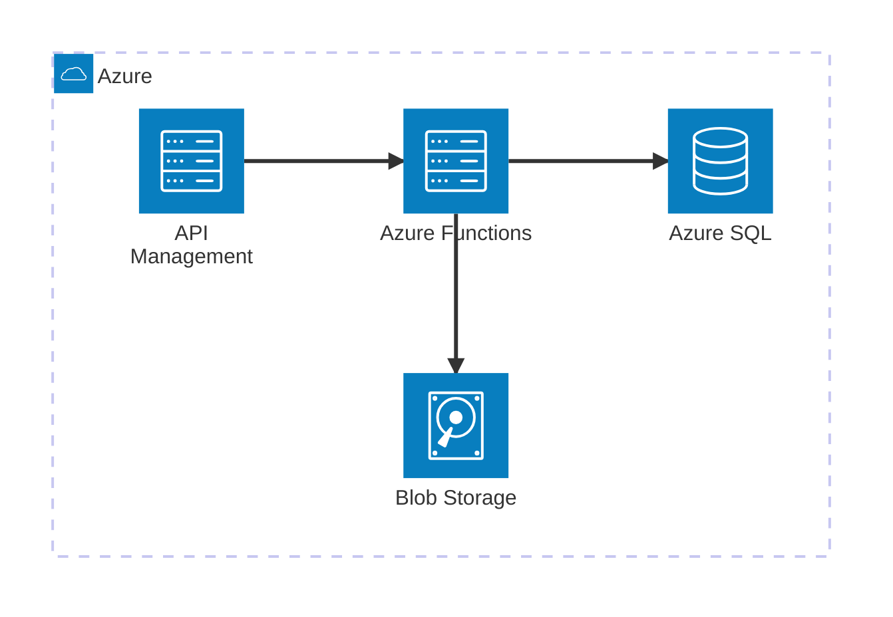
Le code :  
```text
architecture-beta
    group cloud(cloud)[Azure]

    service api(server)[API Management] in cloud
    service func(server)[Azure Functions] in cloud
    service db(database)[Azure SQL] in cloud
    service storage(disk)[Blob Storage] in cloud

    api:R --> L:func
    func:R --> L:db
    func:B --> T:storage
```
---
## Intégration dans Obsidian

J'en parlais dans mon premier article, j'utilise Obsidian pour la rédaction. Il intègre **nativement** la visualisation de Mermaid, sans configuration préalable. 
Il suffit d'utiliser un bloc de code avec le langage `mermaid` :

~~~markdown
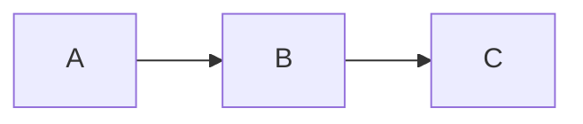
~~~

Le diagramme s'affiche directement dans la vue lecture. 

---
### Plugin communautaire : Mermaid Tools

En plus de cette intégration native, j'utilise le plugin [**Mermaid Tools**](https://obsidian.md/plugins?id=mermaid-tools) ([page Github](https://github.com/dartungar/obsidian-mermaid?tab=readme-ov-file)) qui apporte une barre d'outils dédiée dans l'éditeur Obsidian.

Voici une petite animation de démonstration:  

Ce qu'il m'apporte :
- Une **barre d'outils visuelle** avec un bouton par type de diagramme
- L'**insertion automatique d'un template** prêt à l'emploi en un clic
- Des **snippets personnalisables** 
- Compatible avec tous les types de diagrammes Mermaid

Comme pour la plupart des plugins Obsidian, l'installation est simple :
1. Dans Obsidian, ouvrir `Paramètres → Plugins communautaires`
2. Désactiver le mode restreint si ce n'est pas déjà fait
3. Cliquer sur **Parcourir** et rechercher `Mermaid Tools`
4. Installer et ne pas oublier de l'activer (c'est fréquent quand on débute sur Obsidian)

Le bouton s'ajoute alors sur la toolbar sur la gauche d'Obsidian.


---

Avez-vous déjà utilisé Mermaid ? Dans quels cas d'usages et sur quels outils ?  
N'hésitez pas à me dire si cet article vous a fait découvrir l'outil et si il peut vous être utile !
