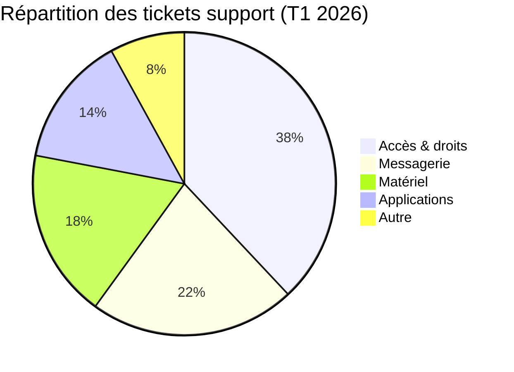
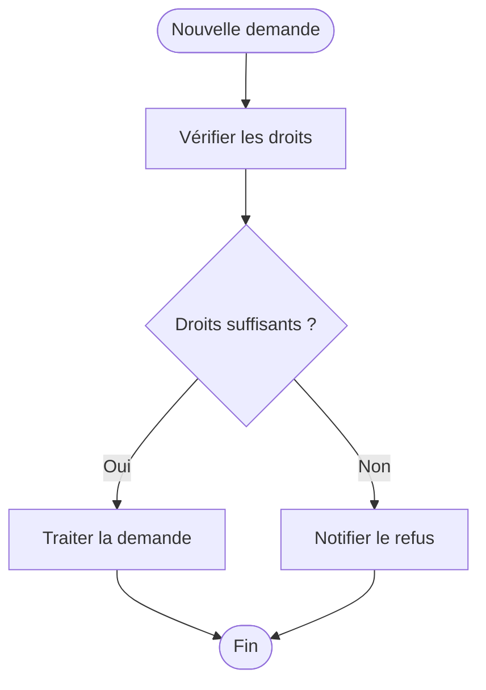
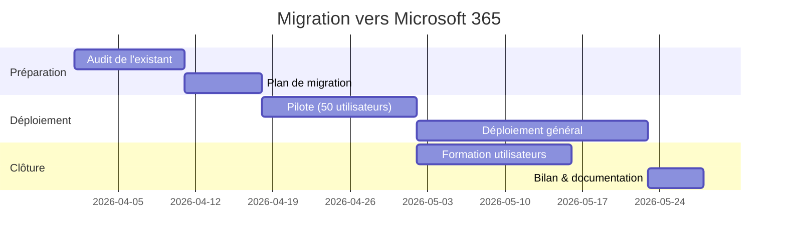
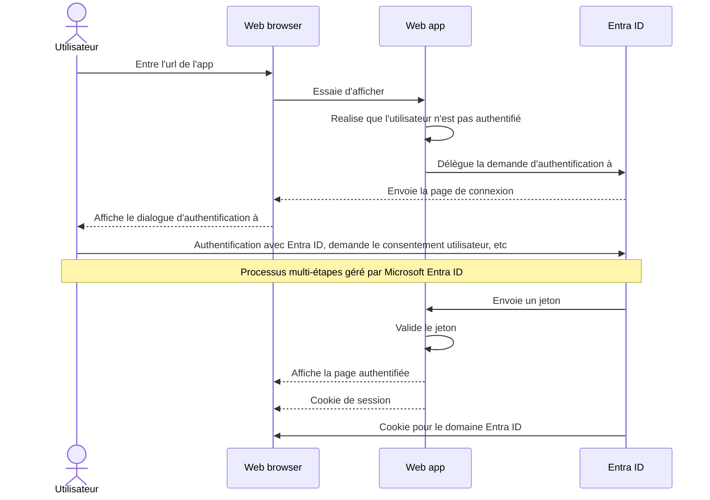
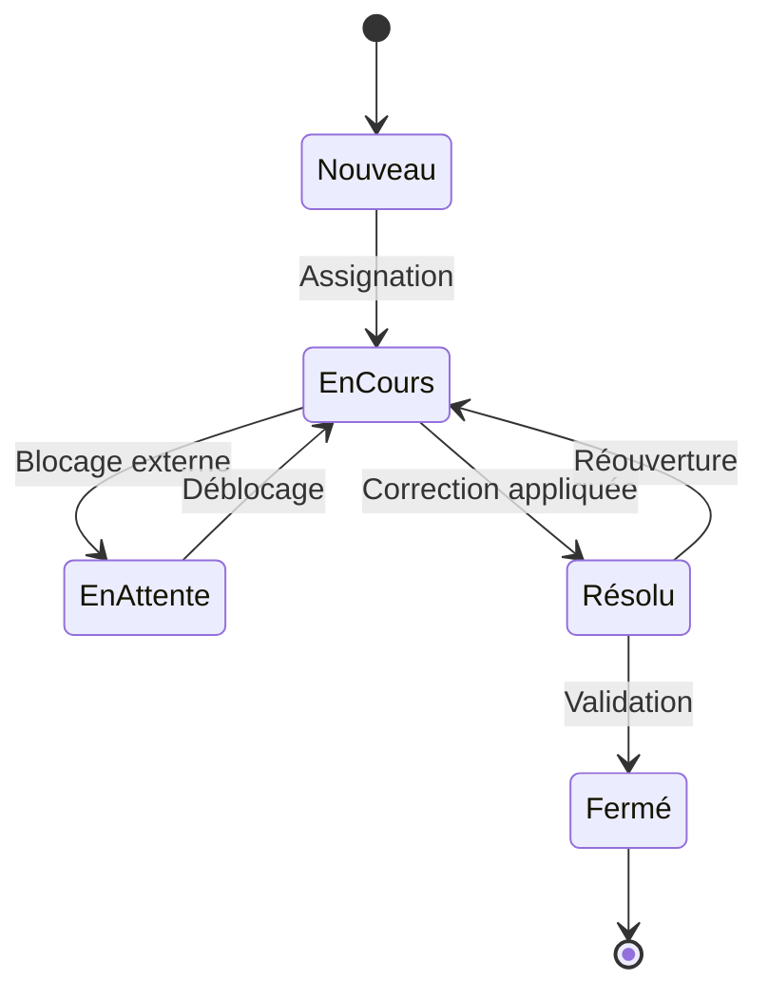
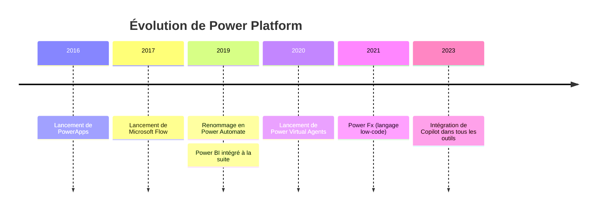
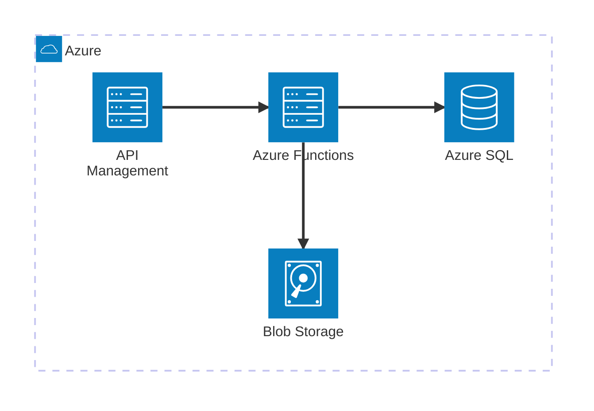
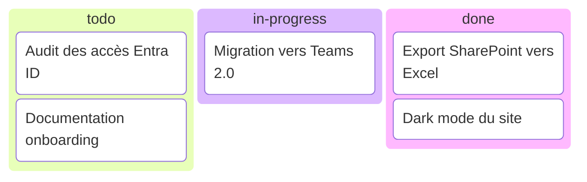
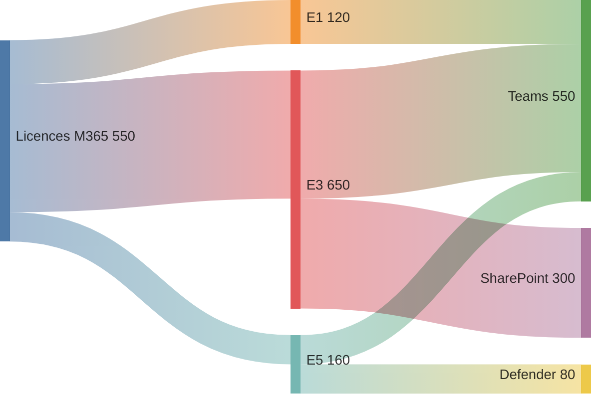
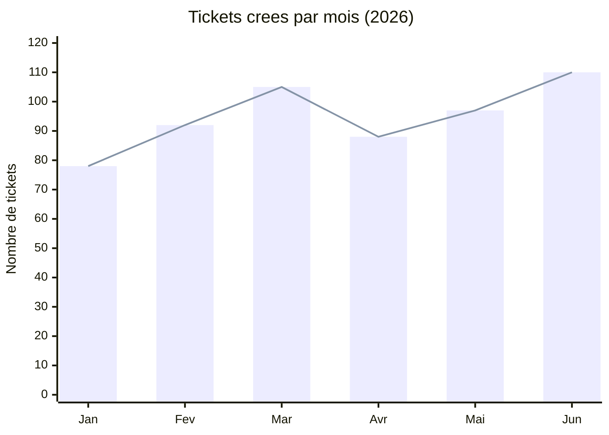

## Qu'est-ce que Mermaid et pourquoi l'utiliser ?

[Mermaid](https://mermaid.ai/open-source/) est une bibliothèque JavaScript qui permet de générer des diagrammes et schémas à partir de texte, inspiré par Markdown.  

J'aime particulièrement m'en servir pour de la documentation technique ou la rédaction d'articles (je vais m'en servir assez souvent sur ce site !), mais c'est aussi souvent utilisé pour des spécifications fonctionnelles, de la gestion de projet ou simplement pour visualiser une idée rapidement.  
Son utilisation est très simple, soit via l'[éditeur gratuit](https://mermaid.ai/live/) , soit via son intégration dans certains outils : sur Obsidian, Github, VSCode, Notion, Microsoft Loop... [la liste est longue](https://mermaid.ai/open-source/ecosystem/integrations-community.html#productivity-tools) !  

Je trouve que les schémas faits de cette façon sont bien plus simples à maintenir que sur Visio par exemple: pas de schéma qui décale tout quand on veut rajouter une action, pas de logiciel ou appli web lourde, et la possibilité d'ajouter des commentaires directement dans le code.

Je présente dans cet article les types de diagramme que j'utilise le plus fréquemment ainsi que la façon dont j'utilise Mermaid sur Obsidian.

N'hésitez pas à aller consulter sa [documentation](https://mermaid.ai/open-source/intro/syntax-reference.html) qui est complète et claire. 

---

## Exemples de diagrammes et schémas
### Un peu de camembert pour commencer ?

Je pense qu'il se passe de présentation, le classique pour représenter visuellement des quantités :



Le code, difficile de faire plus simple :
~~~markdown

~~~
---

### Flowchart
Ensuite l'un des diagrammes les plus courants. Idéal pour modéliser un **processus**, un **algorithme** ou un **flux de décision**.


Le code, on note en particulier l'utilisation de ```-- résultat -->``` pour décrire une branche :
~~~markdown

~~~
---
### Gantt

Le classique de la **planification de projet**. Il représente les tâches, leurs durées et leurs dépendances sur un axe temporel (la barre rouge est le jour actuel).



Le code, les sections se créent dans l'ordre de rédaction :
~~~markdown

~~~
---

### Sequence Diagram

Un classique pour représenter des **échanges entre différents acteurs dans le temps**. Par exemple voici le diagramme d'authentification d'une app sur Entra ID ([original sur Microsoft Learn](https://learn.microsoft.com/fr-fr/entra/identity-platform/app-sign-in-flow)) :



Et le code, où on peut noter les **alias** ainsi que les flèches continues représentées par ```->>``` et discontinues représentées par ```-->>``` :
~~~markdown

~~~
---

### State Diagram

Il est souvent utilisé pour représenter le **cycle de vie** d'un objet ou d'un processus, par exemple un ticket de support, une commande, une demande d'accès…



Le code :
~~~markdown

~~~
---

### Timeline

Représente des **événements dans le temps**, par exemple l'historique d'un projet, l'évolution d'une technologie, les jalons clés...



Le code, il suffit d'ajouter une ligne sans année pour empiler l'évènement sur l'année précédente :
~~~markdown

~~~
---

## Diagrammes en "pré-version"

> [!WARNING] 
> Voici d'autres exemples de diagrammes. Ils sont en préversion, leur utilisation peut changer sur les futures version de Mermaid !

### Architecture Diagram

Représente des **composants d'infrastructure** et leurs connexions, cloud, on-premise, réseaux, services...


Le code, on note les icones qui sont déjà inclues et les ```L / R / B / T``` pour ```Left / Right / Top / Bottom``` décrivant simplement le sens des flèches :
~~~markdown

~~~
---

### Kanban

Classique de la gestion de projet, par exemple pour **documenter un état d'avancement** dans une note ou un README.


Le code, avec un nom par colonne  :
~~~markdown

~~~
---

### Sankey

Représente des **flux et leurs proportions**, répartition de licences, flux financiers, transferts de données, consommation d'énergie...




Le code, où on répète juste la source pour lui ajouter une nouvelle destination :
~~~markdown

~~~
---

### XY Chart

Là aussi, je pense qu'il n'y a pas besoin de le présenter !



Le code :
~~~markdown

~~~
---
## Et ça peut faire des schémas complexes ?

Sans problème !

```mermaid
flowchart TD
    A([Nouvelle demande soumise<br/>via Power Apps]) --> B[Création item<br/>liste SPO Demandes]
    B --> C[Flux principal déclenché<br/>on item created]
    C --> D[Récupérer les métadonnées<br/>de la demande]
    D --> E{Type de<br/>demande ?}

    E -- Achat matériel --> F[Récupérer référent<br/>depuis liste SPO<br/>Référents-Matériel]
    E -- Accès applicatif --> G[Récupérer référent<br/>depuis liste SPO<br/>Référents-Applicatif]
    E -- Dérogation sécurité --> H[Récupérer référent<br/>depuis liste SPO<br/>Référents-Sécurité]

    F & G & H --> I[Mettre à jour item SPO<br/>Statut : En cours<br/>Référent : nom récupéré]
    I --> J[Déclencher flux enfant<br/>Child-Approbation-N1]

    subgraph CHILD1 [Flux enfant - Approbation N1]
        direction TB
        J1[Envoyer approbation Teams<br/>au référent N1]
        J1 --> J2{Réponse<br/>dans 48h ?}
        J2 -- Non --> J3[Relance automatique<br/>par email]
        J3 --> J4{Réponse<br/>dans 24h ?}
        J4 -- Non --> J5[Escalade manager<br/>+ notification Teams]
        J5 --> J6{Réponse<br/>manager ?}
        J6 -- Non --> J7([Retourner : Expiré])
        J2 -- Oui --> J8{Décision ?}
        J4 -- Oui --> J8
        J6 -- Oui --> J8
        J8 -- Approuvé --> J9([Retourner : Approuvé N1<br/>+ commentaires])
        J8 -- Refusé --> J10([Retourner : Refusé<br/>+ motif])
    end

    J --> J1
    J9 --> K{Montant ou<br/>niveau de risque ?}
    J10 --> REFUS

    K -- Moins de 1000 euros / risque faible --> VALID
    K -- Plus de 1000 euros / risque élevé --> M[Mettre à jour SPO<br/>Statut : En attente N2]
    M --> N[Déclencher flux enfant<br/>Child-Approbation-N2]

    subgraph CHILD2 [Flux enfant - Approbation N2]
        direction TB
        N1[Envoyer approbation Teams<br/>avec résumé N1 + pièces jointes]
        N1 --> N2{Réponse<br/>dans 72h ?}
        N2 -- Non --> N3[Relance email<br/>+ notification Teams]
        N3 --> N4{Réponse<br/>dans 48h ?}
        N4 -- Non --> N5([Retourner : Expiré])
        N2 -- Oui --> N6{Décision ?}
        N4 -- Oui --> N6
        N6 -- Approuvé --> N7([Retourner : Approuvé N2<br/>+ commentaires])
        N6 -- Refusé --> N8([Retourner : Refusé N2<br/>+ motif])
    end

    N --> N1
    N7 --> VALID
    N8 --> REFUS

    VALID[Mettre à jour SPO<br/>Statut : Approuvé<br/>Date + Approbateurs] --> O_START[Déclencher flux enfant<br/>Child-Notification-Validation]
    REFUS[Mettre à jour SPO<br/>Statut : Refusé + motif] --> S_START[Déclencher flux enfant<br/>Child-Notification-Refus]

    subgraph CHILD3 [Flux enfant - Notifications validation]
        direction TB
        O1[Envoyer email récapitulatif<br/>au demandeur]
        O1 --> O2[Poster message Teams<br/>dans canal Demandes]
        O2 --> O3{Accès applicatif<br/>ou matériel ?}
        O3 -- Non --> O4([Fin notifications])
        O3 -- Oui --> P_START[Déclencher flux enfant<br/>Child-Provisioning]
    end

    subgraph CHILD4 [Flux enfant - Provisioning]
        direction TB
        P1{Type ?}
        P1 -- Accès applicatif --> P2[Ajouter utilisateur<br/>au groupe Entra ID]
        P1 -- Achat matériel --> P3[Créer item<br/>liste SPO Commandes-IT]
        P2 & P3 --> P4[Journaliser<br/>dans liste SPO Historique]
        P4 --> P5([Fin provisioning])
    end

    subgraph CHILD5 [Flux enfant - Notification refus]
        direction TB
        S1[Envoyer email au demandeur<br/>avec motif détaillé]
        S1 --> S2[Mettre à jour item SPO<br/>Date clôture + Motif]
        S2 --> S3([Fin])
    end

    O_START --> O1
    P_START --> P1
    S_START --> S1
```

Et à mon avis le code n'est pas plus compliqué pour autant :
~~~markdown
```mermaid
flowchart TD
    A([Nouvelle demande soumise<br/>via Power Apps]) --> B[Création item<br/>liste SPO Demandes]
    B --> C[Flux principal déclenché<br/>on item created]
    C --> D[Récupérer les métadonnées<br/>de la demande]
    D --> E{Type de<br/>demande ?}

    E -- Achat matériel --> F[Récupérer référent<br/>depuis liste SPO<br/>Référents-Matériel]
    E -- Accès applicatif --> G[Récupérer référent<br/>depuis liste SPO<br/>Référents-Applicatif]
    E -- Dérogation sécurité --> H[Récupérer référent<br/>depuis liste SPO<br/>Référents-Sécurité]

    F & G & H --> I[Mettre à jour item SPO<br/>Statut : En cours<br/>Référent : nom récupéré]
    I --> J[Déclencher flux enfant<br/>Child-Approbation-N1]

    subgraph CHILD1 [Flux enfant - Approbation N1]
        direction TB
        J1[Envoyer approbation Teams<br/>au référent N1]
        J1 --> J2{Réponse<br/>dans 48h ?}
        J2 -- Non --> J3[Relance automatique<br/>par email]
        J3 --> J4{Réponse<br/>dans 24h ?}
        J4 -- Non --> J5[Escalade manager<br/>+ notification Teams]
        J5 --> J6{Réponse<br/>manager ?}
        J6 -- Non --> J7([Retourner : Expiré])
        J2 -- Oui --> J8{Décision ?}
        J4 -- Oui --> J8
        J6 -- Oui --> J8
        J8 -- Approuvé --> J9([Retourner : Approuvé N1<br/>+ commentaires])
        J8 -- Refusé --> J10([Retourner : Refusé<br/>+ motif])
    end

    J --> J1
    J9 --> K{Montant ou<br/>niveau de risque ?}
    J10 --> REFUS

    K -- Moins de 1000 euros / risque faible --> VALID
    K -- Plus de 1000 euros / risque élevé --> M[Mettre à jour SPO<br/>Statut : En attente N2]
    M --> N[Déclencher flux enfant<br/>Child-Approbation-N2]

    subgraph CHILD2 [Flux enfant - Approbation N2]
        direction TB
        N1[Envoyer approbation Teams<br/>avec résumé N1 + pièces jointes]
        N1 --> N2{Réponse<br/>dans 72h ?}
        N2 -- Non --> N3[Relance email<br/>+ notification Teams]
        N3 --> N4{Réponse<br/>dans 48h ?}
        N4 -- Non --> N5([Retourner : Expiré])
        N2 -- Oui --> N6{Décision ?}
        N4 -- Oui --> N6
        N6 -- Approuvé --> N7([Retourner : Approuvé N2<br/>+ commentaires])
        N6 -- Refusé --> N8([Retourner : Refusé N2<br/>+ motif])
    end

    N --> N1
    N7 --> VALID
    N8 --> REFUS

    VALID[Mettre à jour SPO<br/>Statut : Approuvé<br/>Date + Approbateurs] --> O_START[Déclencher flux enfant<br/>Child-Notification-Validation]
    REFUS[Mettre à jour SPO<br/>Statut : Refusé + motif] --> S_START[Déclencher flux enfant<br/>Child-Notification-Refus]

    subgraph CHILD3 [Flux enfant - Notifications validation]
        direction TB
        O1[Envoyer email récapitulatif<br/>au demandeur]
        O1 --> O2[Poster message Teams<br/>dans canal Demandes]
        O2 --> O3{Accès applicatif<br/>ou matériel ?}
        O3 -- Non --> O4([Fin notifications])
        O3 -- Oui --> P_START[Déclencher flux enfant<br/>Child-Provisioning]
    end

    subgraph CHILD4 [Flux enfant - Provisioning]
        direction TB
        P1{Type ?}
        P1 -- Accès applicatif --> P2[Ajouter utilisateur<br/>au groupe Entra ID]
        P1 -- Achat matériel --> P3[Créer item<br/>liste SPO Commandes-IT]
        P2 & P3 --> P4[Journaliser<br/>dans liste SPO Historique]
        P4 --> P5([Fin provisioning])
    end

    subgraph CHILD5 [Flux enfant - Notification refus]
        direction TB
        S1[Envoyer email au demandeur<br/>avec motif détaillé]
        S1 --> S2[Mettre à jour item SPO<br/>Date clôture + Motif]
        S2 --> S3([Fin])
    end

    O_START --> O1
    P_START --> P1
    S_START --> S1
```
~~~

---
## Intégration dans Obsidian

J'en parlais dans [mon premier article](https://surlesnuages.fr/articles/bienvenue-sur-les-nuages/), j'utilise Obsidian pour la rédaction. Il intègre **nativement** la visualisation de Mermaid, sans configuration préalable. 
Il suffit d'utiliser un bloc de code avec le langage `mermaid` :
~~~markdown
```mermaid
flowchart LR
    A --> B --> C
```
~~~

Le diagramme s'affiche directement dans la vue lecture. 

---
### Plugin communautaire : Mermaid Tools

En plus de cette intégration native, j'utilise le plugin [**Mermaid Tools**](https://obsidian.md/plugins?id=mermaid-tools) ([page Github](https://github.com/dartungar/obsidian-mermaid?tab=readme-ov-file)) qui apporte une barre d'outils dédiée dans l'éditeur Obsidian.

Voici une petite animation de démonstration:

<video autoplay loop muted playsinline preload="metadata" width="1008" height="792" style="max-width:100%;height:auto;" aria-label="Démonstration visuelle sans son : utilisation des outils de prévisualisation Mermaid dans Obsidian">
  <source src="/assets/articles/presentation-mermaid/mermaidtoolsdemo.webm" type="video/webm">
  <source src="/assets/articles/presentation-mermaid/mermaidtoolsdemo.mp4" type="video/mp4">
  <track kind="captions" src="/assets/articles/presentation-mermaid/mermaidtoolsdemo.vtt" srclang="fr" label="Français (pas d'audio)" default>
</video>

Ce qu'il m'apporte :
- Une **barre d'outils visuelle** avec un bouton par type de diagramme
- L'**insertion automatique d'un template** prêt à l'emploi en un clic
- Des **snippets personnalisables** 
- Compatible avec tous les types de diagrammes Mermaid

Comme pour la plupart des plugins Obsidian, l'installation est simple :
1. Dans Obsidian, ouvrir `Paramètres → Plugins communautaires`
2. Désactiver le mode restreint si ce n'est pas déjà fait
3. Cliquer sur **Parcourir** et rechercher `Mermaid Tools`
4. Installer et ne pas oublier de l'activer (c'est fréquent quand on débute sur Obsidian)

Le bouton s'ajoute alors sur la toolbar sur la gauche d'Obsidian.


---

Avez-vous déjà utilisé Mermaid ? Dans quels cas d'usages et sur quels outils ?  
N'hésitez pas à me dire si cet article vous a fait découvrir l'outil et si Mermaid peut vous être utile !
