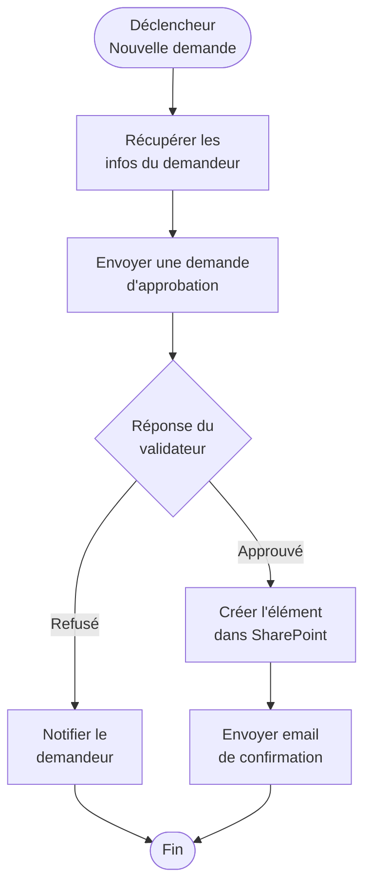
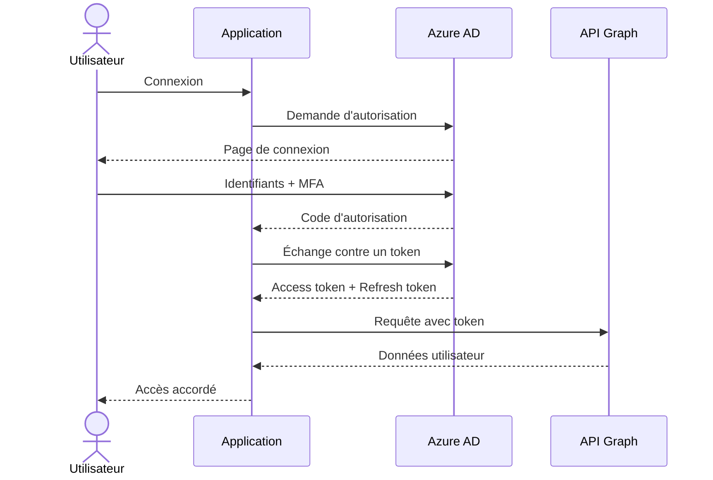
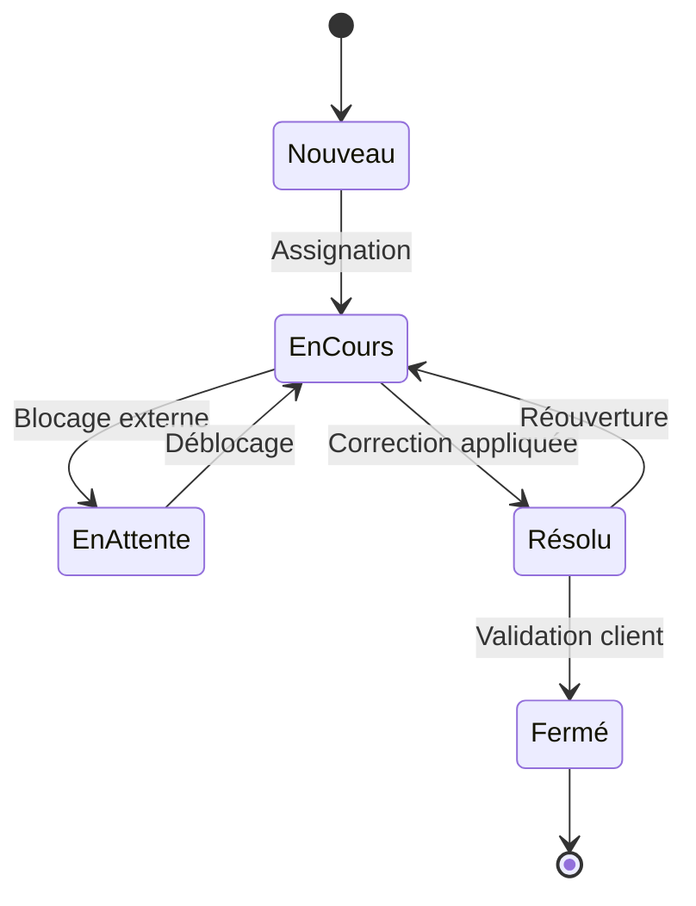

Cet article sert à valider le support des diagrammes [Mermaid](https://mermaid.js.org/) sur le site. Les blocs de code avec le langage `mermaid` sont automatiquement convertis en SVG interactifs — et le thème suit le mode sombre !

## Flowchart — flux Power Automate

Un exemple représentant un flux d'approbation typique sous Power Automate :

## Diagramme de séquence — authentification Azure AD

Exemple d'un flux OAuth 2.0 avec Azure AD :

## Diagramme d'état — cycle de vie d'un ticket

---

Si tu lis cet article, les trois diagrammes ci-dessus devraient s'afficher correctement — et passer en thème sombre si tu actives le mode nuit 🌙
